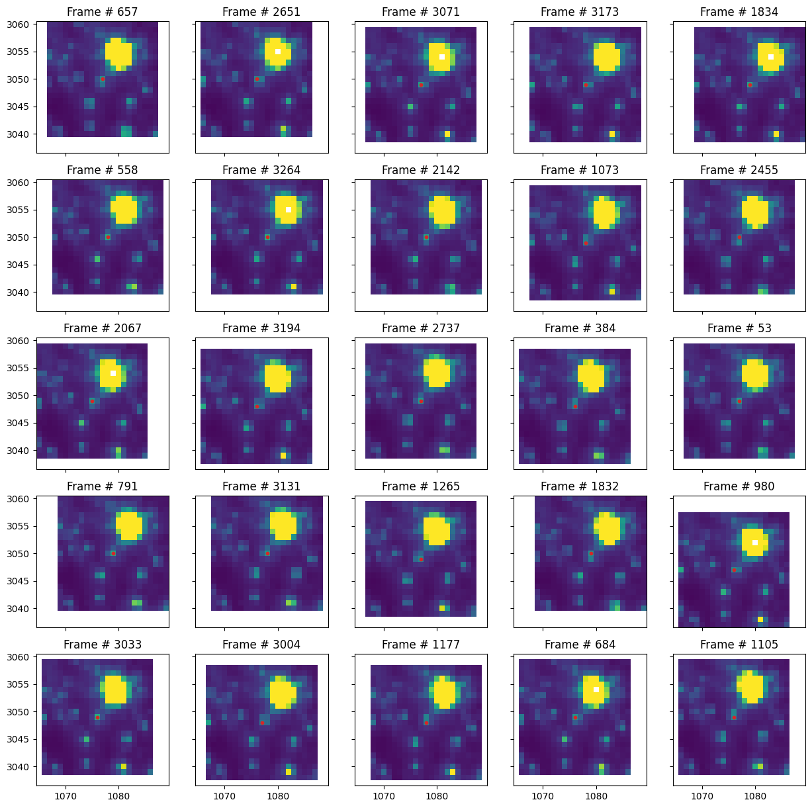
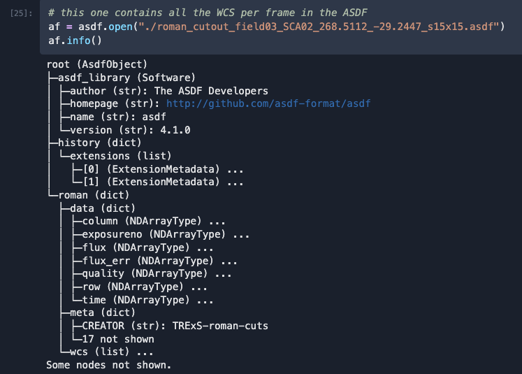

# Roman-cuts

Lightweight package to create image cutouts from simulations made with `RImTimSim`

## Install

Easy install with PyPI
```
pip install roman-cuts
```

## Usage

For more details check out the notebook tutorial [here](./tutorial.ipynb).

```python
from roman_cuts import RomanCuts

# make a list of your local FITS files
fl = paths to local FITS files

rcube = RomanCuts(field=3, sca=1, filter="F146", file_list=fl)

# using sky coord coordinates
radec = (268.461687, -29.232092)
rcube.make_cutout(radec=radec, size=(21, 21), dithered=True)

# or using rowcol pixel coordinates
rowcol = (256, 256)
rcube.make_cutout(rowcol=rowcol, size=(11, 11), dithered=False)

# we can save to disk, default is ASDF
rcube.save_cutout()
```

## Examples
The figure shows a sequence of 21x21 pixel cutouts taken from the FFI simulations 
centered on the target RA, Decl = (268.5112137932491, -29.24473947250156).
This account for dithered observations



The data is saved into a ASDF file as shown below:

